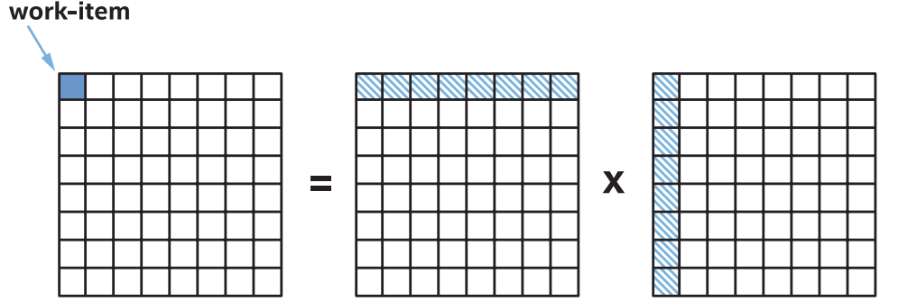
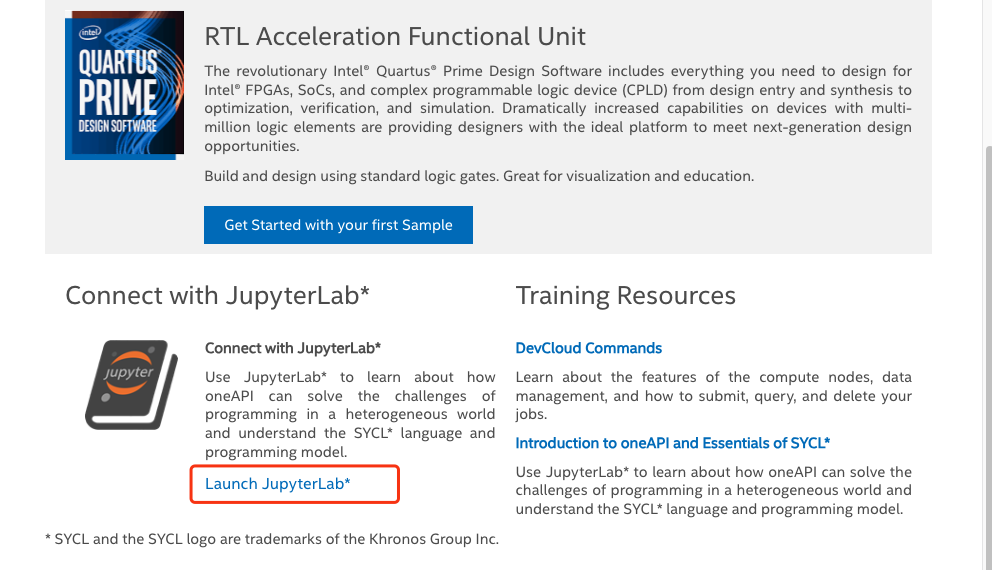
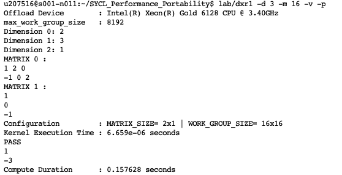

# 北大软微-英特尔校企合作课程作业

课程：C编程技能训练

姓名：董欣然

学号：2301210603


## 作业一： 并⾏矩阵乘法
## 问题描述
编写⼀个基于oneAPI的C++/SYCL程序来执行并⾏矩阵乘法。



## 分析
考虑大尺寸矩阵的乘法操作以及不同线程之间的数据依赖关系。通常在实现矩阵乘法时，可以使用块矩阵乘法以及共享内存来提高计算效率。
步骤如下：
1. 分配内存：在主机端分配内存空间用于存储输⼊矩阵和输出矩阵，同时在GPU端分配内存空间用于存储相应
的输入和输出数据。
2. 数据传输：将输入矩阵数据从主机端内存传输到GPU端内存中。
3. 核函数调用：在SYCL中，矩阵乘法的计算通常会在GPU上使用核函数来实现并行计算。核函数
会分配线程块和线程来处理不同的数据块。
4. 并行计算：在核函数中，每个线程负责计算输出矩阵的⼀个单独的元素。为了最大限度地利用
GPU的并行计算能力，通常会使用⼆维线程块和线程网格的方式来处理矩阵的乘法计算。
5. 数据传输：计算完成后，将输出矩阵数据从GPU端内存传输回主机端内存中，以便进⼀步处理或
分析。
在并行计算矩阵乘法时，可以利用线程块和线程的层次结构来优化计算。通过合理划分矩阵数据并利用共享内
存来减少全局内存访问的次数，可以⼤幅提高计算效率。此外，还可以利用GPU上的多个计算单元并执行行矩阵乘法，进⼀步提高计算速度。


### 代码结构
我们将使用 SYCL 编程语言来实现矩阵乘法并卸载到 GPU 或 CPU。 为了专注于代码增强，我们将通过从矩阵乘法的实际内核实现中分离公共代码来构建我们的应用程序。 由于计算内核是唯一会因各种优化而更改的代码，因此我们将内核计算逻辑代码与其余公共代码分开。

#### [内核代码](https://github.com/007DXR/SYCL-matrix-multiplication/blob/main/dxr.cpp)
矩阵乘法实现的实际内核代码将位于一个单独的源文件中，该文件从公共代码源调用，我们将使用 SYCL 实现内核代码的各种方法，并使用数学内核库实现。 我们将在接下来的几个模块中研究使用不同优化技术和库的内核代码的各种实现 通用代码 公共代码实现了命令行参数选项、初始化矩阵、设置用于卸载的 SYCL 队列以及调用内核代码的函数。 

#### [通用代码](https://github.com/007DXR/SYCL-matrix-multiplication/blob/main/dxr_ndrange_var.cpp)
旨在输入矩阵维度和工作组大小（如果适用），以便可以在运行时设置不同的矩阵大小，以便使用命令行参数进行计算和分析。 我们通过收集内核函数开头和结尾的时间戳来计算卸载到设备的矩阵乘法内核的执行时间。

#### 算法
我们使用私有内存进行 ND 范围的矩阵乘法，下面的示例显示将循环内的中间结果写入内核内定义的变量，该变量转换为加速器硬件中的寄存器。这最大限度地减少了全局内存写入次数并提高了性能，因为每个工作组只将结果写回一次。
```
float temp = 0.f;
for (int k = 0; k < N; k++) {
    temp += A[i*N+k] * B[k*N+j];
}
C[i*N+j] = c;
```


### 项目部署

使用英特尔oneAPI Developer Cloud 服务。
访问[Intel® DevCloud for oneAPI](https://devcloud.intel.com/oneapi/get_started/)，在“Get Started”选项页面中， 点击页面最左下角 Connect with Jupyter* Lab 中的“Launch JupyterLab*”按钮直接启动 Jupypter 服务。



打开终端，并进入文件夹 SYCL_Performance_Portability。

`cd SYCL_Performance_Portability`

添加文件 [dxr.cpp](https://github.com/007DXR/SYCL-matrix-multiplication/blob/main/dxr.cpp) 和 [dxr_ndrange_var.cpp](https://github.com/007DXR/SYCL-matrix-multiplication/blob/main/dxr_ndrange_var.cpp)


### 测试

<!-- `pip install ipywidgets`

- 运行accelerator.py以选择要运行代码的目标设备

`run accelerator.py`
dpcpp lab/dxr.cpp lab/dxr_ndrange_var.cpp -o lab/dxr -w -O3

lab/dxr -d 3 -m 16 -v -p
 -->


####  编译文件


`dpcpp dxr.cpp dxr_ndrange_var.cpp -o dxr -w -O3`

编译代码dxr.cpp和dxr_ndrange_var.cpp，生成可执行文件dxr

####  运行可执行文件


`./dxr -d <DIMENSION> -m <WORK_GROUP_SIZE>  -v -p`

参数有：d（必选），m（必选），v（可选），p（可选）
|d|m|v|p|
|-|-|-|-|
|矩阵维度（矩阵数量+1）|工作组大小|是否验证正确性|打印矩阵|


#### [示例](samples/sample1.txt)
在终端中键入

`./dxr -d 3 -m 16 -v -p`

参数`-d 3 -m 16 -v -p`表示两个矩形，三个维度，工作组大小是16，验证正确性，打印矩阵。终端依次给出提示词： `Dimension <DIMENSION_ID>` 和 `Matrix <MATRIX_ID>`。根据提示词输入数据，第1个矩阵的大小是2 X 3，第2个矩阵的大小是3 X 1，终端显示如下：

```
Dimension 0: 2
Dimension 1: 3
Dimension 2: 1

Matrix 0:
1 2 0
-1 0 2

Matrix 1:
1
0
-1
```

运行结果如下：



由此可知，矩阵乘法的结果是
```
1
-3
```
内核执行时长约等于6.659微秒，计算时长约等于0.158秒。

更多测试用例详见 [samples/](https://github.com/007DXR/SYCL-matrix-multiplication/tree/main/samples)  
<!-- - 选择设备

`./q xxx.sh <DEVICE_NAME>`

xxx.sh 需要包含形如`./dxr -d <DIMENSION> -m <WORK_GROUP_SIZE>  -v -p`的可执行文件

可供选择的设备有：
'GPU Gen9', 'GPU Iris XE Max', 'CPU Xeon 6128', 'CPU Xeon 8153' -->

<!-- #### 示例

! CHMOD 755 ./sample1.sh; ./q sample1.sh "GPU GEN9"

chmod 755 q; chmod 755 sample1.sh; ./q sample1.sh "GPU GEN9";
chmod 755 sample1.sh;  ./sample1.sh;
source /opt/intel/inteloneapi/setvars.sh > /dev/null 2>&1； 
chmod 755 sample1.sh;  ./sample1.sh; -->

